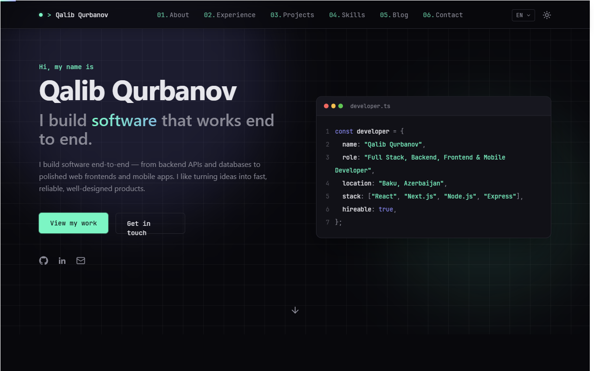

<div align="center">

# 👋 Hi, I'm Qalib Qurbanov

**Full Stack, Backend, Frontend & Mobile Developer** based in Baku, Azerbaijan

I turn ideas into fast, reliable, well-designed products — from backend APIs to polished apps.

### 🌐 [qalibqurbanov.github.io](https://qalibqurbanov.github.io/)

[](https://qalibqurbanov.github.io/)
[](https://github.com/qalibqurbanov)



</div>

---

## ✨ About this repo

This is the source code for my personal portfolio website — a one-page site
showcasing who I am, what I've built, and how to reach me. Available in
**English, Azerbaijani, and Russian**.

## 🛠️ Built with

<div align="center">


</div>

## 🚀 Run it locally

```bash
cd website
npm install
npm run dev
```

Then open `http://localhost:5173`.

## 📬 Get in touch

Check out the [live site](https://qalibqurbanov.github.io/) for my projects,
experience, and contact details.
